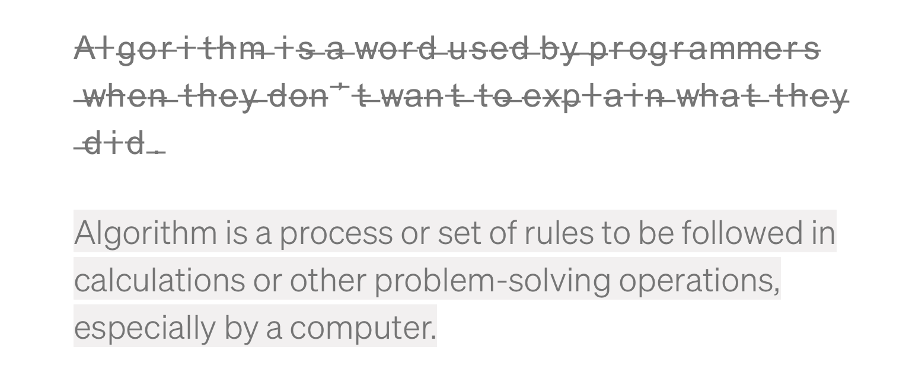
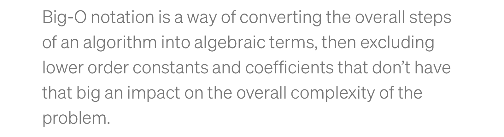
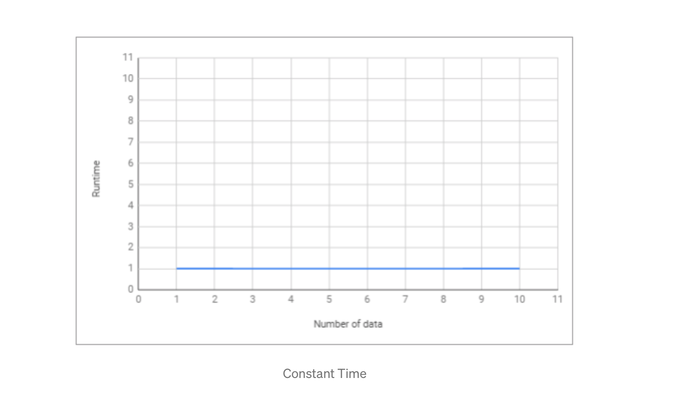

# Penjelasan Sederhana Tentang Time Complexity dan Big-O Notation


Setiap programmer yang baik akan menggunakan cara yang paling efektif dan efisien dalam menyelesaikan suatu permasalahan. Dan untuk bisa melakukan hal tersebut, kita harus bisa meminimalisir kompleksitas dari algoritma yang kita gunakan.

Kompleksitas suatu algoritma dibagi menjadi 2, yaitu Time Complexity dan Space Complexity.

Time Complexity adalah seberapa lama waktu yang diperlukan untuk menjalankan suatu algoritma. Sedangkan Space Complexity adalah seberapa besar memori yang kita gunakan untuk menjalankan suatu algoritma. Dan disini kita hanya akan membahas tentang Time Complexity.

## Algoritma

Sebelum kita melanjutkan pembahasan, kita harus mengerti dulu apa itu algoritma/fungsi.



Sederhananya, algoritma adalah serangkaian proses yang dilakukan secara berurutan untuk menyelesaikan sebuah permasalahan. Algoritma bisa bermacam-macam tergantung kepada siapa yang membuat algoritma tersebut. Namun permasalahannya adalah algoritma mana yang lebih efektif dan efisien?

Seperti halnya yang sering kita hadapi dalam permasalahan sehari-hari, ketika kita akan berpergian ke suatu tempat. Kita tahu ada banyak jalan yang bisa dilalui untuk bisa sampai di tempat tujuan, namun permasalahannya adalah rute mana yang paling cepat yang bisa kita ambil untuk sampai di tempat tujuan?

Time Complexity Analysis adalah suatu cara sederhana untuk mengetahui berapa lama waktu yang dibutuhkan untuk menjalankan suatu algoritma dengan input tertentu (n). Biasanya lebih dikenal dengan sebutan Big-O Notation.

## So, What’s Big-O Notation



Big-O Notation adalah cara untuk mengkonversi keseluruhan langkah-langkah suatu algoritma kedalam bentuk Aljabar, yaitu dengan menghiraukan konstanta yang lebih kecil dan koefisien yang tidak berdampak besar terhadap keseluruhan kompleksitas permasalahan yang diselesaikan oleh algoritma tersebut.

Mari kita liat contoh dibawah ini:
```
Regular       Big-O

2             O(1)   --> It's just a constant number

2n + 10       O(n)   --> n has the largest effect

5n^2          O(n^2) --> n^2 has the largest effect
```

Sederhananya, semua contoh yang ada diatas mengatakan bahwa “kita hanya akan melihat faktor yang memiliki dampak paling besar terhadap nilai yang dihasilkan oleh algoritma tersebut”.

Terdapat beberapa macam time complexity, diantaranya:

## O(1) — Constant Time
 
Constant Time artinya banyaknya input yang diberikan kepada sebuah algoritma, tidak akan mempengaruhi waktu proses (runtime) dari algoritma tersebut.

```
let myArray = [1, 5, 0, 6, 1, 9, 9, 2];

function getFirst(input){
   return input[0]; // selalu melakukan 1 langkah
}

let firstEl = getFirst(myArray);
```

Contoh diatas, terdapat sebuah fungsi untuk mengambil elemen pertama dari sebuah input array. Kita bisa melihat bahwa berapapun jumlah array yang diberikan kepada fungsi tersebut, dia akan selalu melakukan 1 hal, yaitu mengambil elemen pertama. Itu artinya jumlah input yang diberikan tidak mempengaruhi waktu proses (runtime) dari algoritma tersebut.



